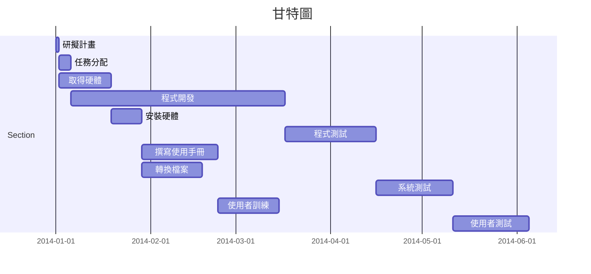
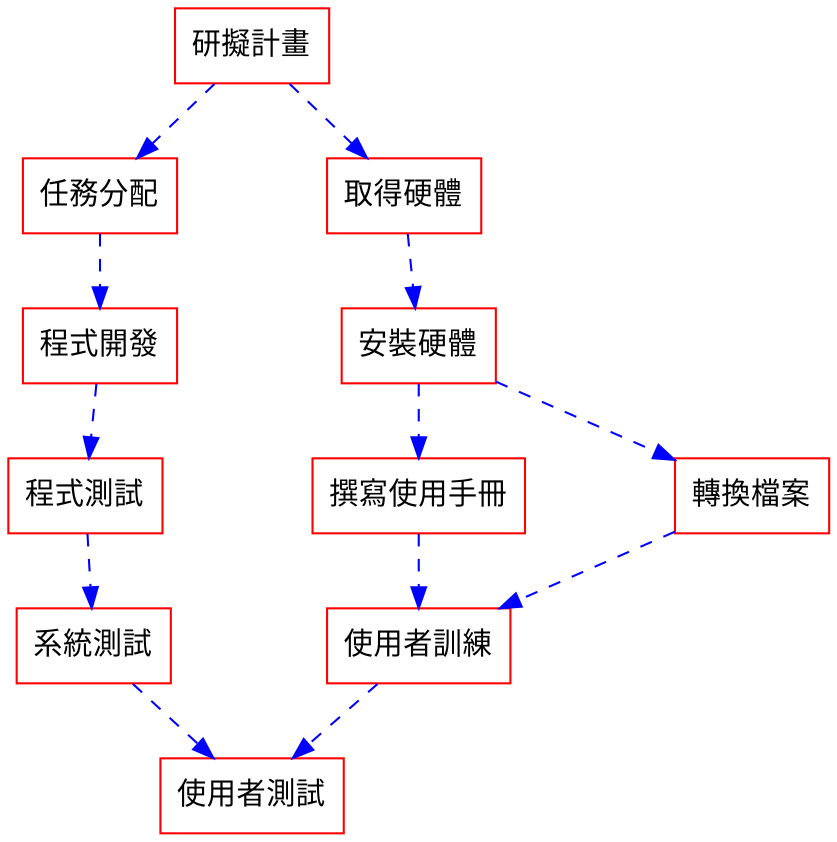

```mermaid
gantt
    title 甘特圖
    dateFormat  YYYY-MM-DD
    section Section
    研擬計畫     :a1, 2014-01-01, 1d
    任務分配     :a2,after a1 , 4d
    取得硬體     :a3,after a1  , 17d
    程式開發     :a4,after a2, 70d
    安裝硬體     :a5,after a3, 10d
    程式測試     :a6,after a4, 30d
    撰寫使用手冊     :a7,after a5, 25d
    轉換檔案     :a8,after a5, 20d
    系統測試     :a9,after a6, 25d
    使用者訓練     :a10,after a7, 20d
    使用者測試     :a11,after a9, 25d

```
---

```graphviz
digraph hierarchy {

                nodesep=1.0 // increases the separation between nodes
                
                node [color=Red,fontname=Courier,shape=box] //All nodes will this shape and colour
                edge [color=Blue, style=dashed] //All the lines look like this

                研擬計畫->{任務分配 取得硬體}
                任務分配->程式開發
                取得硬體->安裝硬體
                程式開發->程式測試
                安裝硬體->{撰寫使用手冊 轉換檔案}
                程式測試->系統測試
                撰寫使用手冊->使用者訓練
                轉換檔案->使用者訓練
                系統測試->使用者測試
                使用者訓練->使用者測試
}
```
