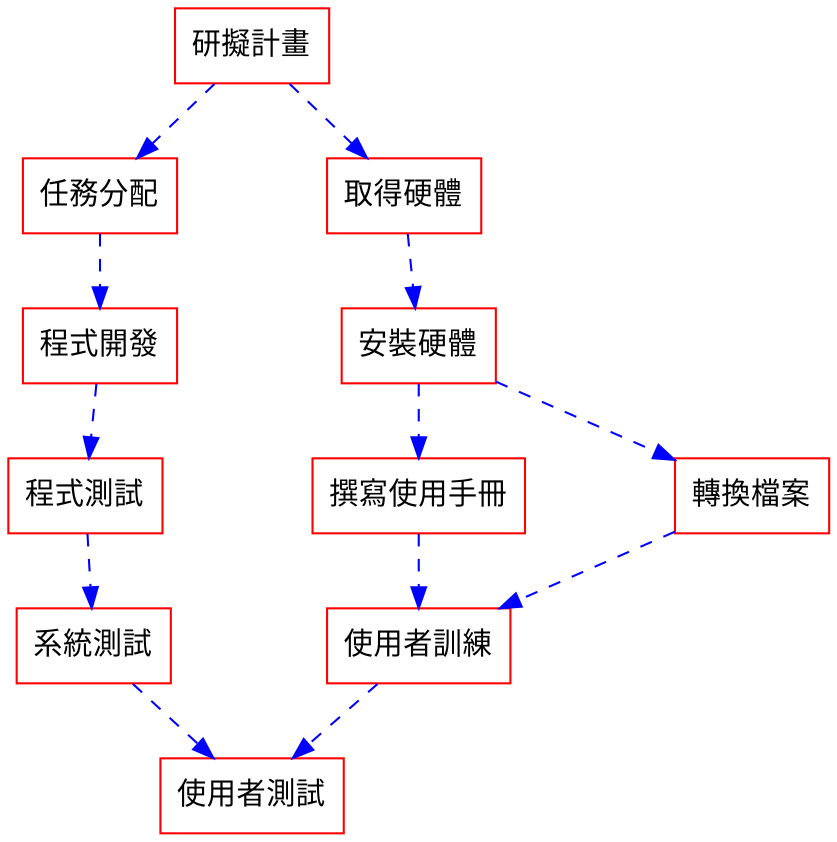

```graphviz
digraph hierarchy {

                nodesep=1.0 // increases the separation between nodes
                
                node [color=Red,fontname=Courier,shape=box] //All nodes will this shape and colour
                edge [color=Blue, style=dashed] //All the lines look like this

                研擬計畫->{任務分配 取得硬體}
                任務分配->程式開發
                取得硬體->安裝硬體
                程式開發->程式測試
                安裝硬體->{撰寫使用手冊 轉換檔案}
                程式測試->系統測試
                撰寫使用手冊->使用者訓練
                轉換檔案->使用者訓練
                系統測試->使用者測試
                使用者訓練->使用者測試
}
```